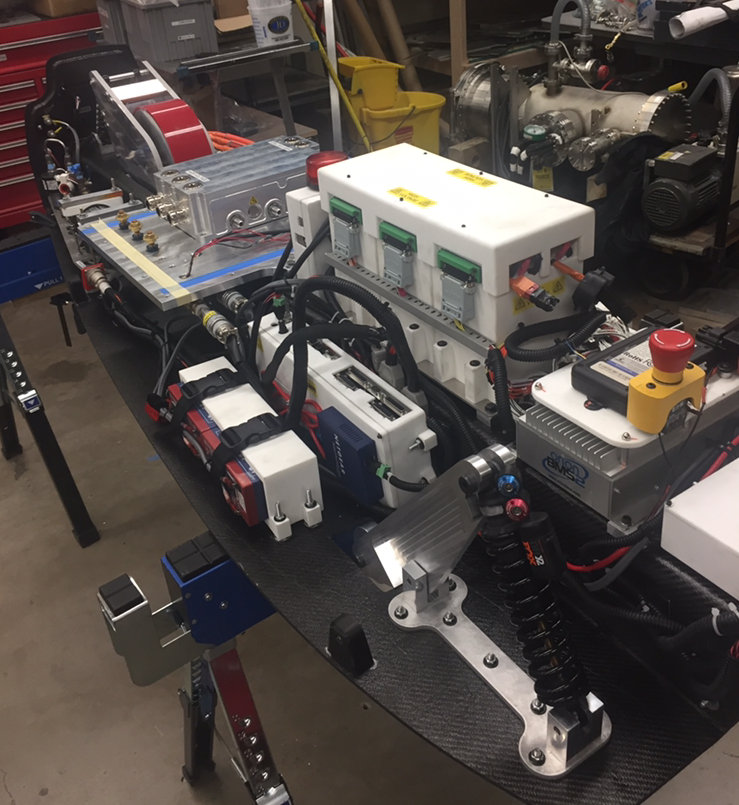

<!-- Main -->

<!-- One -->
<section id="one">
</section>

<!-- Two -->
<section id="two" class="spotlights">
	       <section>
                
                

                        

                                <header class="major">
                                        <h3>Pod I</h3>
                                </header>
                                  
Oh what a time, pod I was my first real exposure to "competitive engineering" projects. I knew basically nothing about electrical engineering, circuit design, SpaceX, or engineering in general. In my first few weeks on campus I ran into a friend from back home who told me about this cool project called hyperloop and said I should go to the first meeting. Four years later, that random encounter on the bike trail in Madison really made a difference in my hobby and career

                
 For this pod, I was on the sensors team, but with little knowledge of sensors (hey, those sense things right?), PCBs, or circuit design, and with a fairly vague tasks, I ended up doing something I knew I could do very well-- maintain extensive Excel spreadsheets for pod harnessing pinout documentation! I'll have to dig those up at some point

                
Competition I ended with a fun trip to California for the first hyperloop competition at SpaceX HQ in Hawthorne. This made me realize that project scope, timelines, and resources are arguable more important to getting a project done than most of the technical challenges that come up.

				
				<ul class="actions">
                                        <li><a href="elements.html" class="button">Learn more</a></li>
                                </ul>
                        

                

        </section>

	
	
	
	<section>
		
		

			

				<header class="major">
					<h3>Pod II</h3>
				</header>
				
Pod II was my introduction to Altium, low voltage power systems and cold gas thrusters. I learned how to make a power budget, worked with mechanical engineers, and learned that there are tons of differences between a CAD model and a product in real life.

				<ul class="actions">
					<li><a href="elements.html" class="button">Learn more</a></li>
				</ul>
			

		

	</section>
	<section>
		
		

			

				<header class="major">
					<h3>Pod III</h3>
				</header>
				
While it was quite the grind, pod III was probably my favorite pod. Without any magnets or cold gas thrusters and with the requirement that we self-propel all the way down the tube, we decided on an electric powertrain system to drive a single wheel. With a really small electrical team, we designed a custom battery pack, powertrain system, and three low voltage control PCBs. The battery pack had a 72s1p using hobby cells, inside of a sealed pressure vessel (maintains atmosphric pressure when the ambient pressure nears vacuum). The battery management system and motor controller / inverter + motor were off the shelf, but we still had to work hard to get all of the pieces working in concert, integrated to the pod, and ensuring everyone was safe around a high voltage system .

				
One of my big takeaways from this pod was that "we'll fix it in software" might be the right solution, but usually means your timeline will get shifted back a few days. I also witnessed a different team have an unfortuante battery safety situation, which drove home the importance of following all safety procedures. 

				<ul class="actions">
					<li><a href="elements.html" class="button">Learn more</a></li>
				</ul>
			

		

	</section>
	<section>
		
		

			

				<header class="major">
					<h3>Pod IV</h3>
				</header>
				
Pod IV is still under development. About a month out from the competition, I think this pod could be the one to make it in the tube, but if I've learned anything from my competition experience, anything can happen in Hawthorne.

				<ul class="actions">
					<li><a href="elements.html" class="button">Learn more</a></li>
				</ul>
			

		

	</section>
</section>

<!-- Three -->
<section id="three">
	

		<header class="major">
			<h2>Future Builds</h2>
		</header>
		
Four pods is enough for me (although I said that after three!). For my last semester on campus, I'm planning on focusing on personal projects, getting a full time job or grad school applications, and moving into a more advisory role on the team. .

		<ul class="actions">
			<li><a href="elements.html" class="button next">Get Started</a></li>
		</ul>
	

</section>

